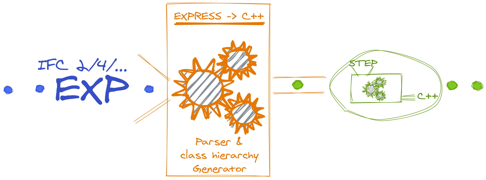

# Usage

CMakeLists.txt
```cmake
express2cpp(./path/to/IFC23.EXP ifc2x3)
add_executable(exe main.cc)
target_link_libraries(exe ifc2x3)
```

main.cc
```cpp
#include "IFC2X3/IfcProduct.h"
#include "IFC2X3/parser.h"

int main() {
  auto model = IFC2X3::parse(ifc_input);
  model.get_entity<IFC2X3::IfcProduct>(1337);
}
```

# Supported Targets

  - GCC 10.2 (10.1 not working!)
  - Clang 11, 12 (previous versions not tested)
  - Apple Clang 12 (previous versions not tested)
  - MSVC Latest (previous versions not tested)
